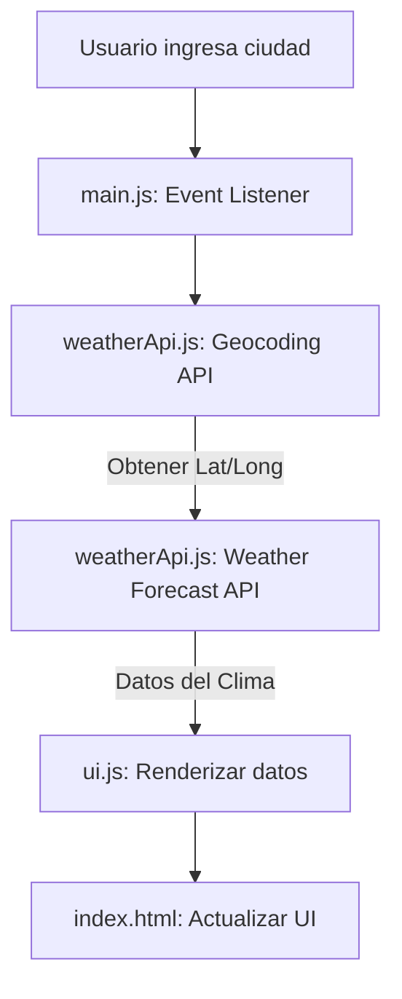

# Plan de Implementación: Aplicación del Clima

Esta aplicación permitirá a los usuarios buscar el clima de cualquier ciudad utilizando la API gratuita de [Open-Meteo](https://open-meteo.com/).

## Estructura de Carpetas Propuesta

```text
/
├── index.html          # Punto de entrada principal
├── css/
│   └── styles.css      # Estilos de la aplicación (CSS puro)
├── js/
│   ├── main.js         # Lógica principal y manejo de eventos del DOM
│   ├── weatherApi.js   # Interacción con la API de Open-Meteo (Fetch)
│   └── ui.js           # Funciones para renderizar datos en el DOM
└── assets/             # Imágenes, iconos o favicon
```

## Arquitectura de la Aplicación



## Consideraciones Técnicas
- **Geocoding:** Open-Meteo requiere coordenadas. Se usará la Geocoding API de Open-Meteo para convertir el nombre de la ciudad a coordenadas.
- **Módulos ES6:** Se utilizarán `import` y `export` para mantener el código modular y limpio.
- **Manejo de Errores:** Se implementará validación para ciudades no encontradas o fallos en la red.
